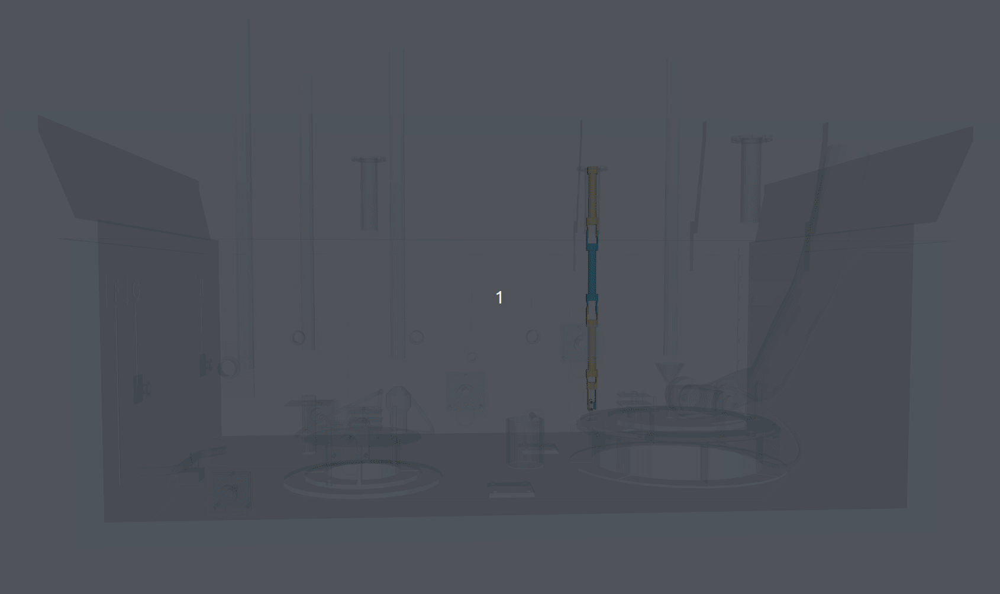

# Hanford Wire Manipulator + ZED X Mini (ROS 2 Description + Isaac Sim Export)

ROS 2 robot description package for a riser-deployed Hanford wire manipulator with an end-effector ZED X Mini camera model. Includes URDF, meshes, and a simple RViz display launch. This repo also documents a reproducible workflow to import the URDF into **NVIDIA Isaac Sim** (URDF → USD) and simulate the **ZED camera stream** using **stereolabs/zed-isaac-sim**.

---

## Demo

<p align="center">
  
</p>

**Isaac Sim environment (preview)**  
<video src="media/Simulation_env_preview.mp4" controls width="900"></video>

**ZED camera view (preview)**  
<video src="media/ZED_camera_view_preview.mp4" controls width="900"></video>

> If the videos don’t render inline on your GitHub viewer, click the files directly in `media/`.

---

## Repository Structure

- `urdf/` — robot URDF(s)
- `meshes/` — STL/OBJ meshes (includes `meshes/zed_x_mini/`)
- `launch/display.launch.py` — quick RViz visual check
- `media/` — demo GIF/videos used in this README

---

## Requirements

### ROS 2 / RViz (for visualization check)
- ROS 2 (Humble recommended)
- `colcon` + common ROS 2 desktop tools (RViz, robot_state_publisher)

### Isaac Sim + ZED simulation
- NVIDIA Isaac Sim **>= 5.0.0**
- ZED SDK installed (same machine that runs Isaac Sim if you want to stream into ZED tools)
- `stereolabs/zed-isaac-sim` extension (build + enable in Isaac Sim)

---

## 1) Build and View the URDF in RViz (sanity check)

Clone this repo into a ROS 2 workspace:

```bash
mkdir -p ~/sensors_ws/src
cd ~/sensors_ws/src
git clone <THIS_REPO_URL>
cd ..
rosdep install --from-paths src --ignore-src -y
colcon build --symlink-install
source install/setup.bash

Launch RViz display:

ros2 launch hanford_wire_manipulator_with_camera_description display.launch.py

If the model looks correct in RViz, you’re ready to export/import in Isaac Sim.
2) Import URDF into Isaac Sim (URDF → USD)

This section converts the URDF into a USD asset that Isaac Sim can simulate efficiently.
A. Open Isaac Sim and enable the URDF importer

    Launch Isaac Sim

    Open Window → Extensions

    Search for and enable isaacsim.asset.importer.urdf (URDF Importer)

B. Import the URDF

    Go to File → Import…

    Select URDF and choose:

        urdf/robot_pit_end_effector.urdf (or your main URDF file)

    Recommended import settings (good defaults for stability):

        Links: choose Static base for a fixed-base arm (or Moveable base if you want the base to move)

        Colliders:

            enable Collision From Visuals if collision meshes are not provided

            keep Allow self-collision = false unless you are sure meshes don’t interpenetrate

        Joints and Drives:

            start with conservative stiffness/damping; tune later if needed

    Import, then File → Save As… to store the stage as:

        usd/hanford_wire_manipulator.usd (recommended)

    Tip: If you plan to reuse the robot in many scenes, save it as a referenced asset (USD reference) and bring it into environments as needed.

3) Simulate the ZED X camera using stereolabs/zed-isaac-sim

The Stereolabs Isaac Sim extension streams your virtual ZED camera output into the ZED SDK pipeline, so you can use ZED tools and/or the ZED ROS 2 wrapper with a simulated camera.
A. Clone + build the ZED Isaac Sim extension

cd ~/projects
git clone https://github.com/stereolabs/zed-isaac-sim.git
cd zed-isaac-sim
# Linux:
./build.sh
# Windows:
# build.bat

B. Add the extension search path in Isaac Sim

    In Isaac Sim: Window → Extensions

    Open Settings (hamburger menu)

    Under Extension Search Paths, click +

    Add the path to:

        <path-to-zed-isaac-sim>/exts

    In the Third-Party tab, enable ZED Camera extension.

    If your Isaac Sim UI won’t let you edit extension paths, you can also launch Isaac Sim with an extension folder argument (see Troubleshooting).

C. Add a ZED X camera prim to the stage

You have two common options:

Option 1 (recommended): use the ZED X USD provided by Stereolabs

    Drag ZED_X.usd into the stage (from the Stereolabs repo assets)

    The prim contains a base_link which is the mounting reference frame.

Option 2: keep your mesh from this URDF and add a camera sensor

    This is useful if you only need Isaac Sim camera sensors, but the full ZED streaming workflow is simplest with Option 1.

D. Attach (parent) the ZED camera to your robot end-effector

In the Stage tree:

    Expand your imported robot prim

    Locate the end-effector link prim

    Drag the ZED camera prim under that end-effector link prim (parent it)

    Adjust the transform so the ZED camera sits correctly on the mount

    Practical workflow: first align visually, then fine-tune in the Property panel using precise XYZ / RPY.

E. Create the Action Graph to stream to ZED SDK

    Open Window → Visual Scripting → Action Graph

    Create a new graph

    Add nodes:

        On Playback Tick

        ZED Camera Helper (from the ZED extension)

    Connect:

        On Playback Tick.outputs:tick → ZED Camera Helper.inputs:ExecIn

    Set in ZED Camera Helper properties:

        ZED Camera prim: pick your ZED camera prim in the stage

        Camera Model: match the camera type you added (ZED X / stereo / etc.)

        FPS / Resolution / IPC: tune for performance (IPC is best when streaming locally)

Press Play. You should see console output indicating the stream is active.
Acknowledgements

NVIDIA Isaac Sim URDF Importer workflow

Stereolabs ZED Isaac Sim extension: https://github.com/stereolabs/zed-isaac-sim